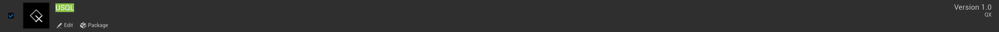
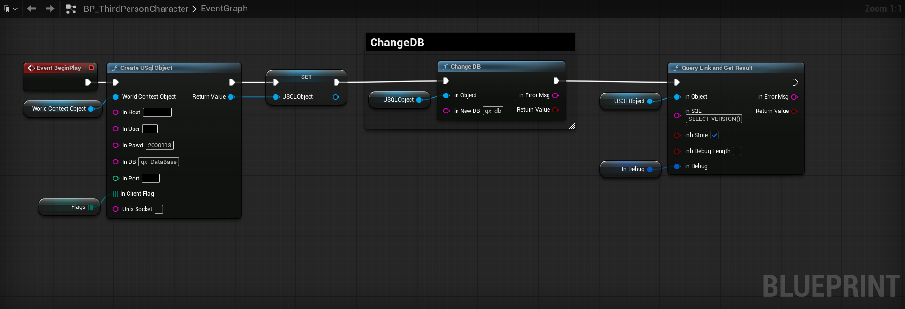
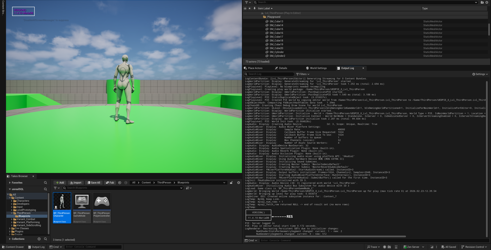
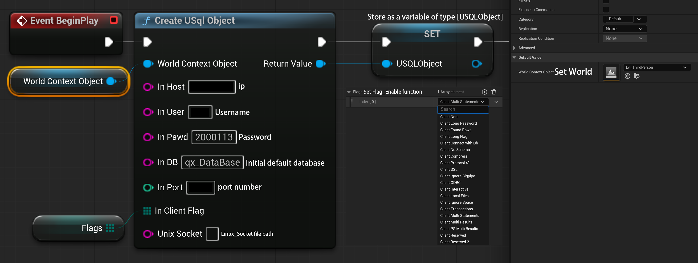
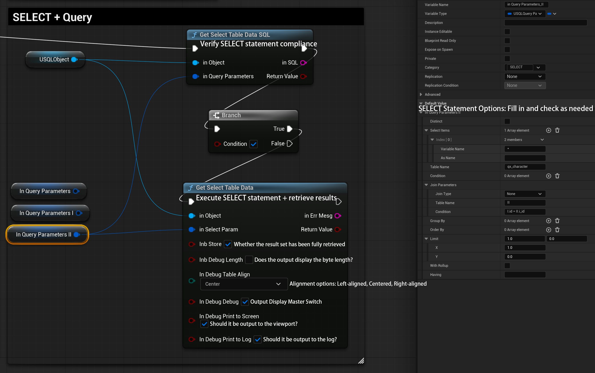
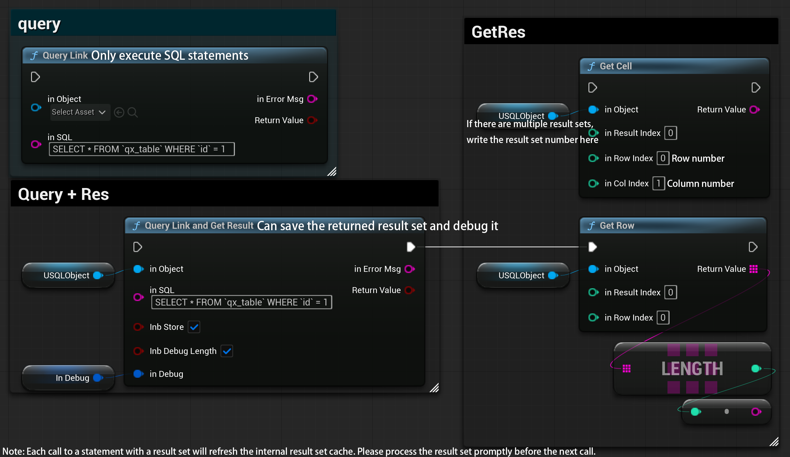
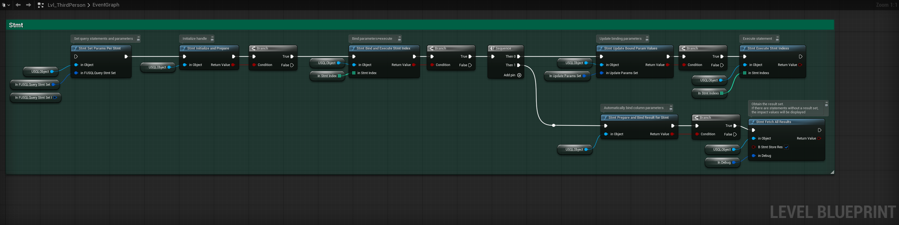
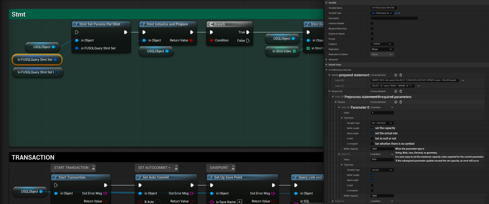
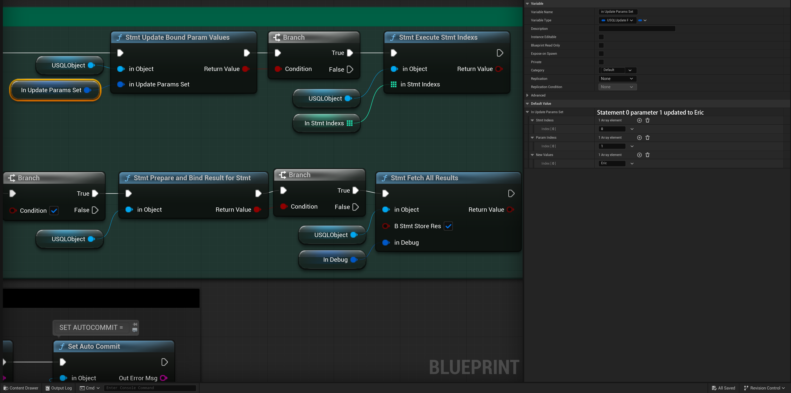

# USQL

USQL is a C++ plugin that integrates MariaDB directly into Unreal Engine 5.

------

## Supported Versions

- Unreal Engine 5.6 – 5.7
- MariaDB 11.4.10
- Windows x64

 

## Installation

1. Ensure MariaDB has been downloaded and installed, and the service is running.
   https://mariadb.org/download/?t=mariadb&p=mariadb&r=12.2.2&os=windows&cpu=x86_64&pkg=msi&mirror=xtom_fre

2. Copy plugin to:`YourProject/Plugins`

3. Enable USQL plugin in the plugin list

4. Create nodes in the blueprint and use (Complete blueprint nodes_CreateUSQLObject)

 

## Complete blueprint nodes

1. Blueprint Node Path：`..\Content\ThirdPerson\Blueprints\BP_ThirdPersonCharacter`
   
2. The image is too large and the preview may not display properly. Please download and watch it

 

## Node Annotation

1.CreateUSQLObject

2.SELECT

3.Query

4.Stmt

-----
> [!NOTE]
> · Both sending and receiving data use utf8mb4 encoding \
> · Please strictly follow the naming rules set by MariaDB official \
>   https://mariadb.com/docs/server/reference/sql-structure/sql-language-structure/identifier-names \
> · One connection corresponds to one thread. If you need to perform parallel queries, please use the "Create USql Object" node to create a new connection for querying.
