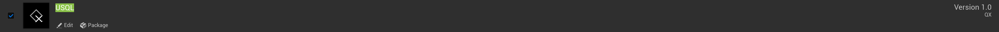
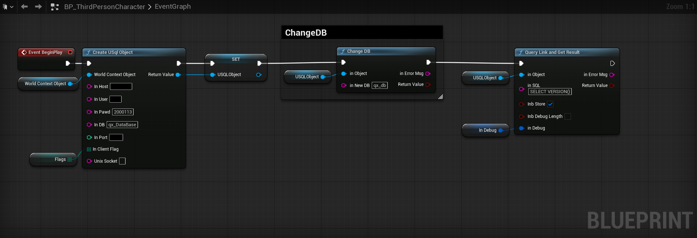
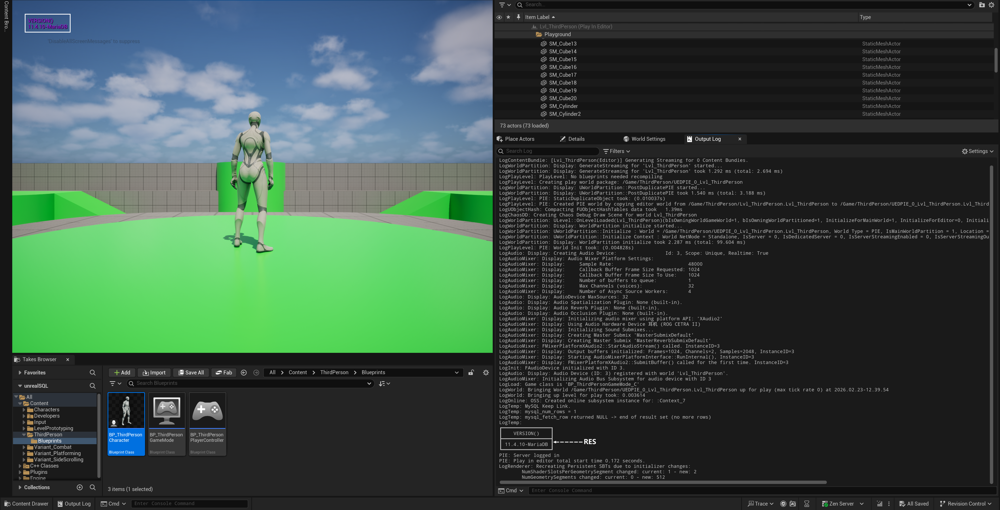
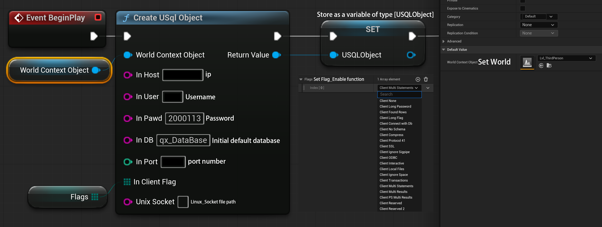
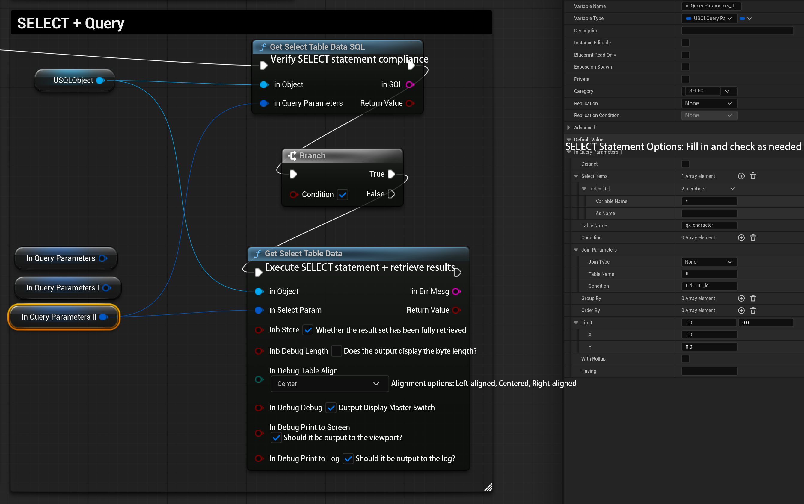
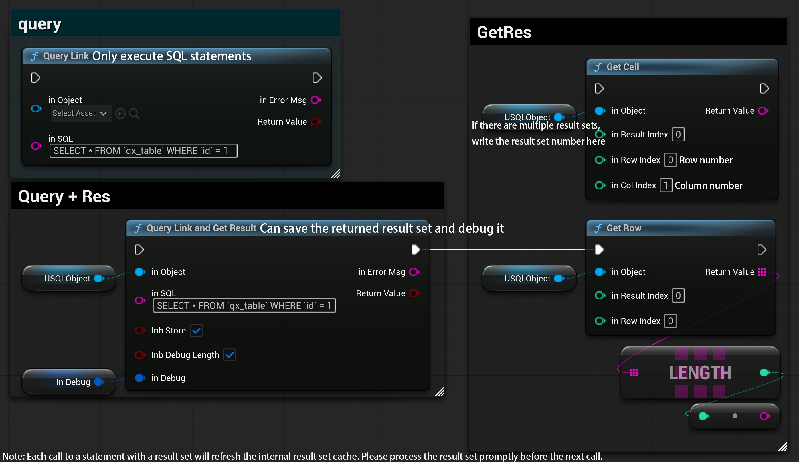
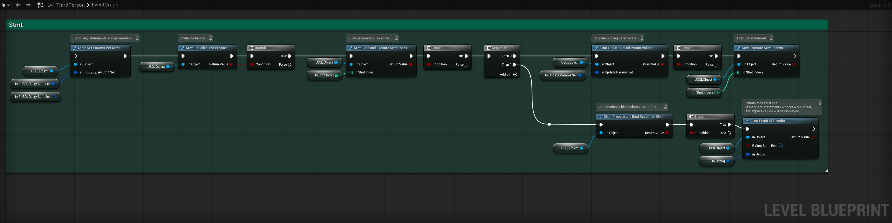
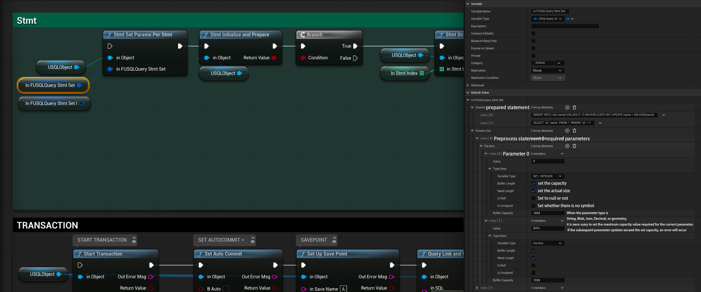
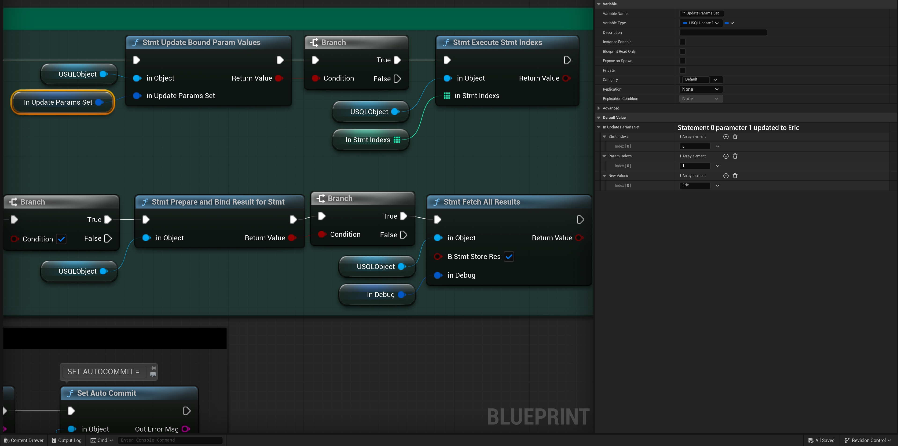

# USQL

USQL is a C++ plugin that integrates MariaDB directly into Unreal Engine 5.

------

## Supported Versions

- Unreal Engine 5.6 – 5.7
- MySQL 5.7+、MySQL 5.7+、MariaDB 10+
- Windows x64

 

## Installation

1. Install MariaDB Connector/C (Required)
   
   This plugin requires the MariaDB Connector/C client library to communicate with MySQL/MariaDB databases.

   1.1 Download MariaDB Connector/C from the official website:
    https://mariadb.com/downloads/connectors/connectors-data-access/c/

   1.2 Install the connector (64-bit version).

   1.3 After installation, locate the following directories (example):
   >C:\Program Files\MariaDB\lib
   
   >C:\Program Files\MariaDB\lib\plugin

   1.4 Add the above directories to your system PATH environment variable.
   
   1.5 Restarting the computer or Unreal Engine may be required for environment variable changes to take effect.
   
3. Copy plugin to:`YourProject/Plugins`

4. Enable USQL plugin in the plugin list

5. Create nodes in the blueprint and use (Complete blueprint nodes_CreateUSQLObject)

 

## Node Annotation

1.CreateUSQLObject

2.SELECT

3.Query

4.Stmt

## Complete blueprint nodes

1. Blueprint Node Path：`..\Content\ThirdPerson\Blueprints\BP_ThirdPersonCharacter`
   
2. The image is too large and the preview may not display properly. Please download and watch it

 

-----
> [!NOTE]
> · This plugin bundles the MariaDB client libraries for Windows 64-bit.
>   No separate installation of a MariaDB server is required to use the plugin itself.
>   However, to connect to a database, you need access to an existing MariaDB or MySQL server (local or remote). 
>   The server must be installed and configured independently. \
> · Both sending and receiving data use utf8mb4 encoding \
> · Please strictly follow the naming rules set by MariaDB official \
>   https://mariadb.com/docs/server/reference/sql-structure/sql-language-structure/identifier-names \
> · One connection corresponds to one thread. If you need to perform parallel queries, please use the "Create USql Object" node to create a new connection for querying.
